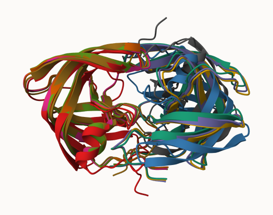
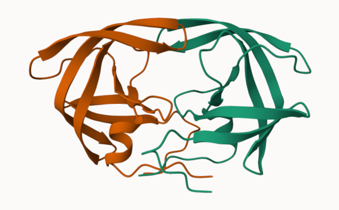
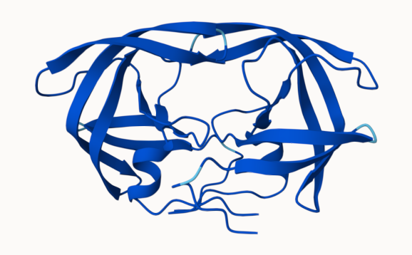
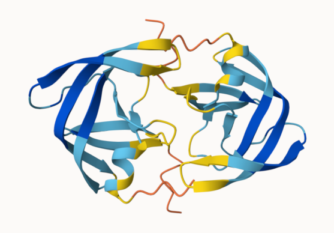
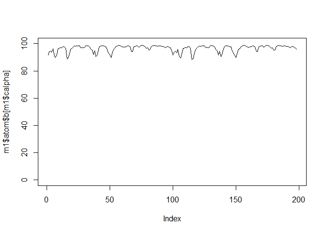
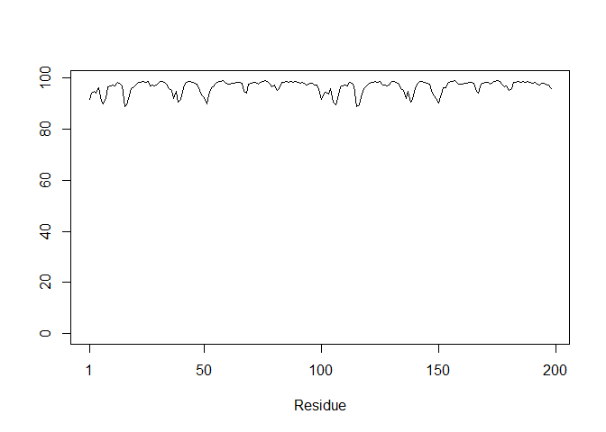
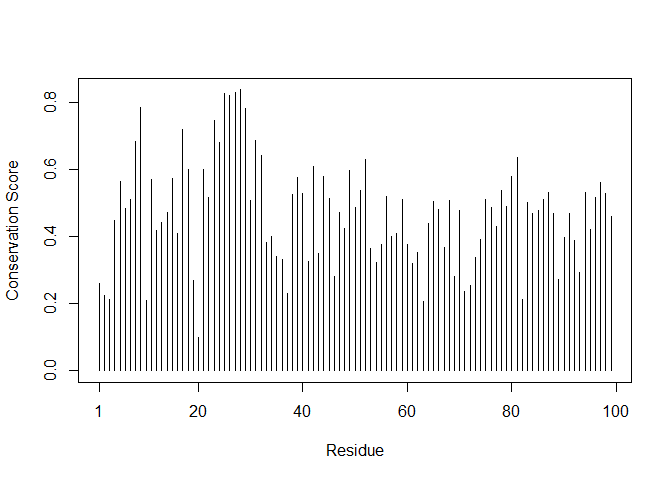

# Class 11: Structural Bioinformatics pt2
Berne Chu (A18608434)

- [AlphaFold Data Base (AFDB)](#alphafold-data-base-afdb)
- [Generating your own structure
  predictions](#generating-your-own-structure-predictions)
- [Custom analysis of resulting modesl in
  R](#custom-analysis-of-resulting-modesl-in-r)
  - [Residue conversion from alignment
    file](#residue-conversion-from-alignment-file)

## AlphaFold Data Base (AFDB)

The EBI maintains the largest database of AlphaFold structure prediction
models at: https://alphafold.ebi.ac.uk

From last class (before Halloween) we saw that the PDB had 244,280 (Oct
2025)

The total number of protein sequences in UniProtKB is 199,579,901

> **Key point**: This is a tiny fraction of sequence spave that has
> structural coverage (0.12%)

``` r
244290/199579901*100
```

    [1] 0.1224021

AFBD is attempting to address this gap…

There are two “Quality Scores” from AlphaFold one for residues
(i.e. each amino acid) called **pLDDT** score. The other **PAE** score
mesures the confidence in the relative position of two residues
(i.e. score for every pair of residues).

## Generating your own structure predictions

Figure of 5 generated HIV-PR models



And the top ranked model colored by chain



pLDDT score for model 1



and model 5



# Custom analysis of resulting modesl in R

Read key result files into R. The first thing I need to know is what my
results directory/folder is called (i.e. its name is different for every
AlphaFold run/job)

``` r
results_dir <- "HIVPR_dimer_23119/"

# File names for all PDB models
pdb_files <- list.files(path=results_dir,
                        pattern="*.pdb",
                        full.names = TRUE)

# Print our PDB file names
basename(pdb_files)
```

    [1] "HIVPR_dimer_23119_unrelaxed_rank_001_alphafold2_multimer_v3_model_4_seed_000.pdb"
    [2] "HIVPR_dimer_23119_unrelaxed_rank_002_alphafold2_multimer_v3_model_1_seed_000.pdb"
    [3] "HIVPR_dimer_23119_unrelaxed_rank_003_alphafold2_multimer_v3_model_5_seed_000.pdb"
    [4] "HIVPR_dimer_23119_unrelaxed_rank_004_alphafold2_multimer_v3_model_2_seed_000.pdb"
    [5] "HIVPR_dimer_23119_unrelaxed_rank_005_alphafold2_multimer_v3_model_3_seed_000.pdb"

``` r
library(bio3d)

m1 <- read.pdb(pdb_files[1])
m1
```


     Call:  read.pdb(file = pdb_files[1])

       Total Models#: 1
         Total Atoms#: 1514,  XYZs#: 4542  Chains#: 2  (values: A B)

         Protein Atoms#: 1514  (residues/Calpha atoms#: 198)
         Nucleic acid Atoms#: 0  (residues/phosphate atoms#: 0)

         Non-protein/nucleic Atoms#: 0  (residues: 0)
         Non-protein/nucleic resid values: [ none ]

       Protein sequence:
          PQITLWQRPLVTIKIGGQLKEALLDTGADDTVLEEMSLPGRWKPKMIGGIGGFIKVRQYD
          QILIEICGHKAIGTVLVGPTPVNIIGRNLLTQIGCTLNFPQITLWQRPLVTIKIGGQLKE
          ALLDTGADDTVLEEMSLPGRWKPKMIGGIGGFIKVRQYDQILIEICGHKAIGTVLVGPTP
          VNIIGRNLLTQIGCTLNF

    + attr: atom, xyz, calpha, call

``` r
pdbs <- pdbaln(pdb_files, fit=TRUE, exefile="msa")
```

    Reading PDB files:
    HIVPR_dimer_23119/HIVPR_dimer_23119_unrelaxed_rank_001_alphafold2_multimer_v3_model_4_seed_000.pdb
    HIVPR_dimer_23119/HIVPR_dimer_23119_unrelaxed_rank_002_alphafold2_multimer_v3_model_1_seed_000.pdb
    HIVPR_dimer_23119/HIVPR_dimer_23119_unrelaxed_rank_003_alphafold2_multimer_v3_model_5_seed_000.pdb
    HIVPR_dimer_23119/HIVPR_dimer_23119_unrelaxed_rank_004_alphafold2_multimer_v3_model_2_seed_000.pdb
    HIVPR_dimer_23119/HIVPR_dimer_23119_unrelaxed_rank_005_alphafold2_multimer_v3_model_3_seed_000.pdb
    .....

    Extracting sequences

    pdb/seq: 1   name: HIVPR_dimer_23119/HIVPR_dimer_23119_unrelaxed_rank_001_alphafold2_multimer_v3_model_4_seed_000.pdb 
    pdb/seq: 2   name: HIVPR_dimer_23119/HIVPR_dimer_23119_unrelaxed_rank_002_alphafold2_multimer_v3_model_1_seed_000.pdb 
    pdb/seq: 3   name: HIVPR_dimer_23119/HIVPR_dimer_23119_unrelaxed_rank_003_alphafold2_multimer_v3_model_5_seed_000.pdb 
    pdb/seq: 4   name: HIVPR_dimer_23119/HIVPR_dimer_23119_unrelaxed_rank_004_alphafold2_multimer_v3_model_2_seed_000.pdb 
    pdb/seq: 5   name: HIVPR_dimer_23119/HIVPR_dimer_23119_unrelaxed_rank_005_alphafold2_multimer_v3_model_3_seed_000.pdb 

``` r
pdbs
```

                                   1        .         .         .         .         50 
    [Truncated_Name:1]HIVPR_dime   PQITLWQRPLVTIKIGGQLKEALLDTGADDTVLEEMSLPGRWKPKMIGGI
    [Truncated_Name:2]HIVPR_dime   PQITLWQRPLVTIKIGGQLKEALLDTGADDTVLEEMSLPGRWKPKMIGGI
    [Truncated_Name:3]HIVPR_dime   PQITLWQRPLVTIKIGGQLKEALLDTGADDTVLEEMSLPGRWKPKMIGGI
    [Truncated_Name:4]HIVPR_dime   PQITLWQRPLVTIKIGGQLKEALLDTGADDTVLEEMSLPGRWKPKMIGGI
    [Truncated_Name:5]HIVPR_dime   PQITLWQRPLVTIKIGGQLKEALLDTGADDTVLEEMSLPGRWKPKMIGGI
                                   ************************************************** 
                                   1        .         .         .         .         50 

                                  51        .         .         .         .         100 
    [Truncated_Name:1]HIVPR_dime   GGFIKVRQYDQILIEICGHKAIGTVLVGPTPVNIIGRNLLTQIGCTLNFP
    [Truncated_Name:2]HIVPR_dime   GGFIKVRQYDQILIEICGHKAIGTVLVGPTPVNIIGRNLLTQIGCTLNFP
    [Truncated_Name:3]HIVPR_dime   GGFIKVRQYDQILIEICGHKAIGTVLVGPTPVNIIGRNLLTQIGCTLNFP
    [Truncated_Name:4]HIVPR_dime   GGFIKVRQYDQILIEICGHKAIGTVLVGPTPVNIIGRNLLTQIGCTLNFP
    [Truncated_Name:5]HIVPR_dime   GGFIKVRQYDQILIEICGHKAIGTVLVGPTPVNIIGRNLLTQIGCTLNFP
                                   ************************************************** 
                                  51        .         .         .         .         100 

                                 101        .         .         .         .         150 
    [Truncated_Name:1]HIVPR_dime   QITLWQRPLVTIKIGGQLKEALLDTGADDTVLEEMSLPGRWKPKMIGGIG
    [Truncated_Name:2]HIVPR_dime   QITLWQRPLVTIKIGGQLKEALLDTGADDTVLEEMSLPGRWKPKMIGGIG
    [Truncated_Name:3]HIVPR_dime   QITLWQRPLVTIKIGGQLKEALLDTGADDTVLEEMSLPGRWKPKMIGGIG
    [Truncated_Name:4]HIVPR_dime   QITLWQRPLVTIKIGGQLKEALLDTGADDTVLEEMSLPGRWKPKMIGGIG
    [Truncated_Name:5]HIVPR_dime   QITLWQRPLVTIKIGGQLKEALLDTGADDTVLEEMSLPGRWKPKMIGGIG
                                   ************************************************** 
                                 101        .         .         .         .         150 

                                 151        .         .         .         .       198 
    [Truncated_Name:1]HIVPR_dime   GFIKVRQYDQILIEICGHKAIGTVLVGPTPVNIIGRNLLTQIGCTLNF
    [Truncated_Name:2]HIVPR_dime   GFIKVRQYDQILIEICGHKAIGTVLVGPTPVNIIGRNLLTQIGCTLNF
    [Truncated_Name:3]HIVPR_dime   GFIKVRQYDQILIEICGHKAIGTVLVGPTPVNIIGRNLLTQIGCTLNF
    [Truncated_Name:4]HIVPR_dime   GFIKVRQYDQILIEICGHKAIGTVLVGPTPVNIIGRNLLTQIGCTLNF
    [Truncated_Name:5]HIVPR_dime   GFIKVRQYDQILIEICGHKAIGTVLVGPTPVNIIGRNLLTQIGCTLNF
                                   ************************************************ 
                                 151        .         .         .         .       198 

    Call:
      pdbaln(files = pdb_files, fit = TRUE, exefile = "msa")

    Class:
      pdbs, fasta

    Alignment dimensions:
      5 sequence rows; 198 position columns (198 non-gap, 0 gap) 

    + attr: xyz, resno, b, chain, id, ali, resid, sse, call

``` r
rd <- rmsd(pdbs, fit=T)
```

    Warning in rmsd(pdbs, fit = T): No indices provided, using the 198 non NA positions

``` r
range(rd)
```

    [1]  0.000 14.526

``` r
head(m1$atom)
```

      type eleno elety  alt resid chain resno insert      x      y      z o     b
    1 ATOM     1     N <NA>   PRO     A     1   <NA> 16.906 -3.867 -6.191 1 91.62
    2 ATOM     2    CA <NA>   PRO     A     1   <NA> 16.891 -2.436 -6.500 1 91.62
    3 ATOM     3     C <NA>   PRO     A     1   <NA> 16.391 -1.590 -5.328 1 91.62
    4 ATOM     4    CB <NA>   PRO     A     1   <NA> 15.914 -2.350 -7.684 1 91.62
    5 ATOM     5     O <NA>   PRO     A     1   <NA> 15.805 -2.121 -4.383 1 91.62
    6 ATOM     6    CG <NA>   PRO     A     1   <NA> 15.016 -3.537 -7.527 1 91.62
      segid elesy charge
    1  <NA>     N   <NA>
    2  <NA>     C   <NA>
    3  <NA>     C   <NA>
    4  <NA>     C   <NA>
    5  <NA>     O   <NA>
    6  <NA>     C   <NA>

``` r
plot(m1$atom$b[m1$calpha],typ="l", ylim=c(0,100))
```



``` r
plot.bio3d(m1$atom$b[m1$calpha], typ="l")
```



## Residue conversion from alignment file

Find the large AlphaFold alignment file

``` r
aln_file <- list.files(path=results_dir,
                       pattern=".a3m$",
                        full.names = TRUE)
aln_file
```

    [1] "HIVPR_dimer_23119/HIVPR_dimer_23119.a3m"

Load this into R

``` r
aln <- read.fasta(aln_file[1], to.upper = TRUE)
```

    [1] " ** Duplicated sequence id's: 101 **"
    [2] " ** Duplicated sequence id's: 101 **"

How many sequences are in this alignment

``` r
dim(aln$ali)
```

    [1] 5397  132

We can score residue conservation in the alignment with the conserv()
function.

``` r
sim <- conserv(aln)
```

``` r
plotb3(sim[1:99], ylab="Conservation Score")
```



``` r
con <- consensus(aln,cutoff=0.9)
con$seq
```

      [1] "-" "-" "-" "-" "-" "-" "-" "-" "-" "-" "-" "-" "-" "-" "-" "-" "-" "-"
     [19] "-" "-" "-" "-" "-" "-" "D" "T" "G" "A" "-" "-" "-" "-" "-" "-" "-" "-"
     [37] "-" "-" "-" "-" "-" "-" "-" "-" "-" "-" "-" "-" "-" "-" "-" "-" "-" "-"
     [55] "-" "-" "-" "-" "-" "-" "-" "-" "-" "-" "-" "-" "-" "-" "-" "-" "-" "-"
     [73] "-" "-" "-" "-" "-" "-" "-" "-" "-" "-" "-" "-" "-" "-" "-" "-" "-" "-"
     [91] "-" "-" "-" "-" "-" "-" "-" "-" "-" "-" "-" "-" "-" "-" "-" "-" "-" "-"
    [109] "-" "-" "-" "-" "-" "-" "-" "-" "-" "-" "-" "-" "-" "-" "-" "-" "-" "-"
    [127] "-" "-" "-" "-" "-" "-"
