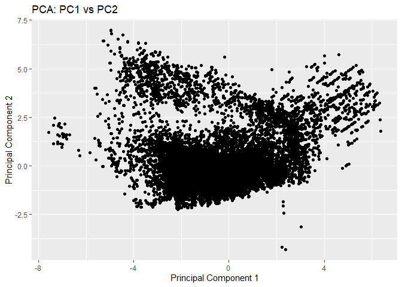
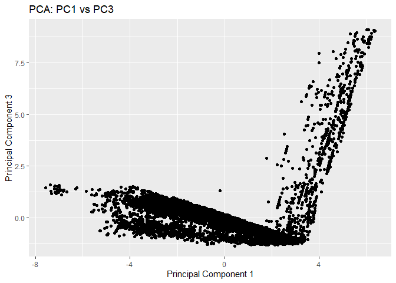
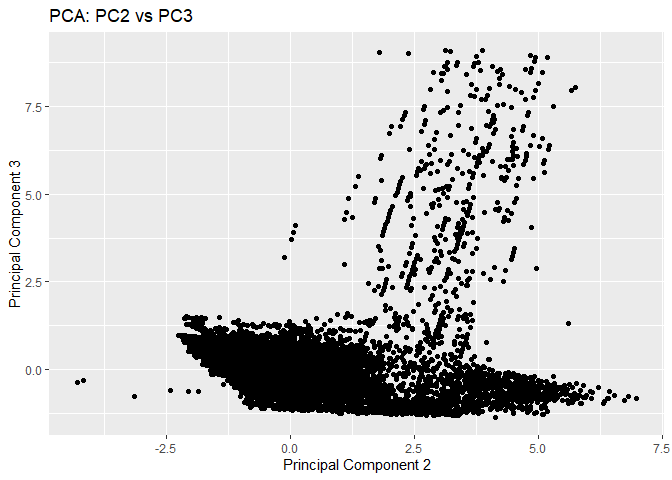

# Class 16
Berne Chu (A18608434)

## PCA on BLAST results

Import tsv with my results

``` r
library(readr)
results <- read_tsv("my_results.tsv")
```

    Rows: 39829 Columns: 12
    ── Column specification ────────────────────────────────────────────────────────
    Delimiter: "\t"
    chr  (2): NP_034603.2, XP_002663941.1
    dbl (10): 44.444, 90, 46, 1, 644, 733, 295, 380, 6.07e-20, 94.4

    ℹ Use `spec()` to retrieve the full column specification for this data.
    ℹ Specify the column types or set `show_col_types = FALSE` to quiet this message.

``` r
head(results)
```

    # A tibble: 6 × 12
      NP_034603.2 XP_002663941.1 `44.444`  `90`  `46`   `1` `644` `733` `295` `380`
      <chr>       <chr>             <dbl> <dbl> <dbl> <dbl> <dbl> <dbl> <dbl> <dbl>
    1 NP_034603.2 XP_021335885.1     41.7    96    46     2   644   733   295   386
    2 NP_034603.2 XP_021329952.2     43.2    74    41     1   660   733   217   289
    3 NP_036084.2 XP_073799717.1     28.2   209   140     6    17   220     1   204
    4 NP_036084.2 NP_001156326.1     25.9   205   143     3    27   224    24   226
    5 NP_036084.2 XP_073785644.1     24.3   136    97     1    87   216    18   153
    6 NP_036084.2 XP_068079900.1     26.6   143    98     3    87   224   112   252
    # ℹ 2 more variables: `6.07e-20` <dbl>, `94.4` <dbl>

Set colnames

``` r
colnames(results) <- c("qseqid", "sseqid", "pident", "length", "mismatch",
                       "gapopen", "qstart", "qend", "sstart", "send",
                       "evalue", "bitscore")
head(results)
```

    # A tibble: 6 × 12
      qseqid      sseqid    pident length mismatch gapopen qstart  qend sstart  send
      <chr>       <chr>      <dbl>  <dbl>    <dbl>   <dbl>  <dbl> <dbl>  <dbl> <dbl>
    1 NP_034603.2 XP_02133…   41.7     96       46       2    644   733    295   386
    2 NP_034603.2 XP_02132…   43.2     74       41       1    660   733    217   289
    3 NP_036084.2 XP_07379…   28.2    209      140       6     17   220      1   204
    4 NP_036084.2 NP_00115…   25.9    205      143       3     27   224     24   226
    5 NP_036084.2 XP_07378…   24.3    136       97       1     87   216     18   153
    6 NP_036084.2 XP_06807…   26.6    143       98       3     87   224    112   252
    # ℹ 2 more variables: evalue <dbl>, bitscore <dbl>

**PCA plots**

PCA using `prcomp()`

``` r
pca <- prcomp(results[, c("pident", "length", "mismatch", "gapopen", "evalue",
                          "bitscore")], scale. = TRUE)
summary(pca)
```

    Importance of components:
                              PC1    PC2    PC3     PC4     PC5     PC6
    Standard deviation     1.6628 1.4658 0.9012 0.48100 0.19268 0.07616
    Proportion of Variance 0.4608 0.3581 0.1353 0.03856 0.00619 0.00097
    Cumulative Proportion  0.4608 0.8189 0.9543 0.99285 0.99903 1.00000

PC1 vs PC2

``` r
library(ggplot2)
ggplot(pca$x, aes(x = PC1, y = PC2)) +
  geom_point() +
  ggtitle("PCA: PC1 vs PC2") +
  xlab("Principal Component 1") +
  ylab("Principal Component 2")
```



PC1 vs PC3

``` r
ggplot(pca$x, aes(x = PC1, y = PC3)) +
  geom_point() +
  ggtitle("PCA: PC1 vs PC3") +
  xlab("Principal Component 1") +
  ylab("Principal Component 3")
```



PC2 vs PC3

``` r
ggplot(pca$x, aes(x = PC2, y = PC3)) +
  geom_point() +
  ggtitle("PCA: PC2 vs PC3") +
  xlab("Principal Component 2") +
  ylab("Principal Component 3")
```


